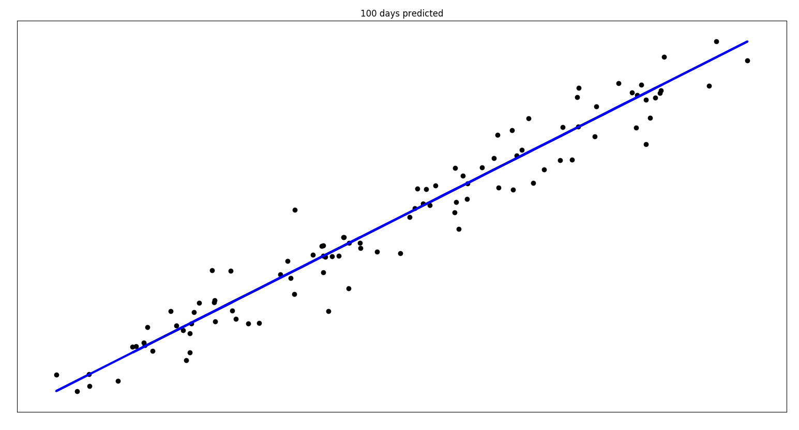
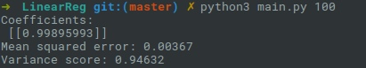

# LinearReg
Machine Learning: LinearRegression for Price Prediction

## Introduction

This personal project is LinearRegression for Price Prediction to discover the learning machine.

## Features/ Roadmap
- [x] **Based on Python 3.5.2**: For botting on any operating system -
Windows, macOS and Linux
- [x] **Using Kaggle Dataset**: [Bitcoin Historical Data](https://www.kaggle.com/mczielinski/bitcoin-historical-data)
- [x] **2D plotting with Matplotlib**
- [x] **Machine Learning - Predicting price**: Linear Regressor

## Optimization

